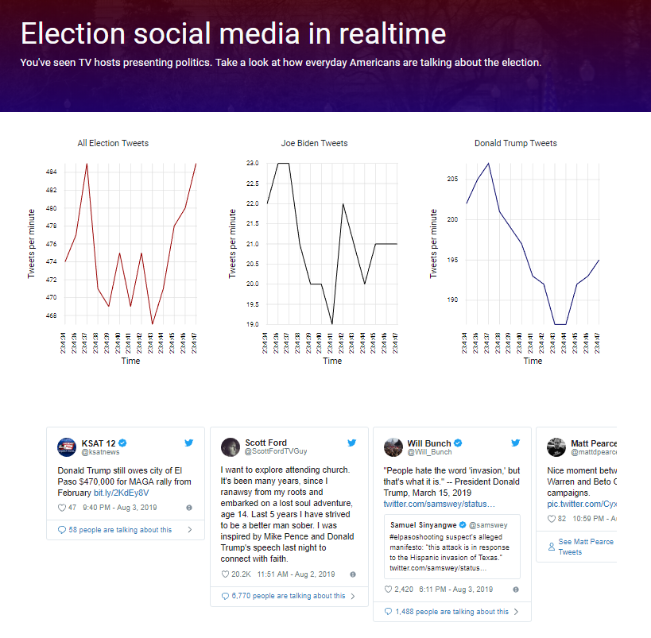

# Visualizing live election tweets
### Using Redis, Elasticsearch, ExpressJS, and Angular to search high-volume tweets (40 per second) in real-time. Deployed using Docker and Kubernetes on Google Cloud.

## Getting started

Clone: `git clone https://github.com/cpgeier/real-time.ml.git`

Navigate: `cd real-time.ml/site`

Build: `npm install && ng serve --prod`

## Background

There are more than 20 tweets per second about current politics in America. Wouldn't it be cool to have a way to see these tweets in real-time? This repo is an implimentation of a high-volume data framework that consumes streaming data from Twitter and visualizes the tweets in an Angular front-end. Although this project specifically focuses on tweets about US politics, the parameters in this repo can be changed to visualize any topic on Twitter. 

## Building the repo
  - Configure environment file
    - Elasticsearch url
    - Twitter API config
  - In stream folder: `docker-compose up`
  - In api folder: `node index`
  - In site folder: `ng serve`

## Hosting online
  - Netlify to host site folder (free)
  - Bonsai to host elasticsearch (free)
  - Heroku to host ExpressJS API (free)
  - Google Cloud to host Kubernetes cluster ($11/month)
 
Even though this stack seems pretty heavy, taking advantage of free hosting services makes the infrastructure super cheap or free if you also use free credits on your cloud provider.
